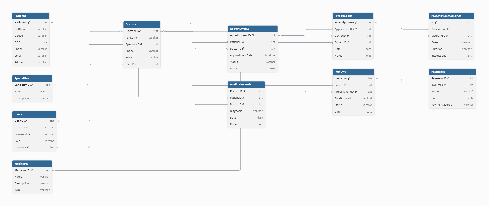

# Doctors Clinic Management System – ASP.NET Core Web API

This project is a **Doctors Clinic Management System** developed as a modern, modular, and secure **Web API**.  
The system is built using the latest technologies and best practices in software engineering to ensure scalability, maintainability, and high performance.

## Technologies Used

- **ASP.NET Core Web API (.NET 8)**  
  Used as the main framework to build a robust, scalable, and cross-platform backend.

- **Entity Framework Core (EF Core)**  
  Used as the Object-Relational Mapper (ORM) to handle all database operations and relationships easily and efficiently.

- **PostgreSQL**  
  Chosen as the relational database for its reliability, performance, and advanced features.

- **Clean Architecture**  
  Applied to separate concerns, enforce clear boundaries between layers, and make the codebase maintainable and testable.

- **Swagger (API Documentation)**  
  Used to auto-generate interactive API documentation for easy testing and integration.

- **Mapster & DTO (Data Transfer Object)**  
  Used to map entities to DTOs for clean, secure, and optimized data transfer between layers and to the client.

- **Authentication & Authorization**  
  Implemented to secure the API and manage access control based on user roles and permissions.

- **Seeder**  
  Used to pre-populate the database with essential or sample data automatically at startup.

- **Pagination**  
  Implemented to efficiently manage and deliver large sets of data in a user-friendly way.

- **Middleware Handling Global Exception**  
  Custom middleware was developed to catch and handle unhandled exceptions globally, ensuring consistent error responses.

- **Principles of Writing Code (SOLID)**  
  Followed throughout the project to ensure code quality, readability, and maintainability.

## Features

- Doctor, patient, appointments, medical records, prescriptions, and payment management.
- Secure authentication and role-based authorization.
- RESTful APIs with interactive Swagger UI documentation.
- Robust database relationships and seeding.
- Clean code architecture for easy extension and testing.
- Advanced error handling and logging.
- Pagination for all data listing endpoints.

## Why Each Technology/Concept Was Used

- **ASP.NET Core Web API**: To create a cross-platform and high-performance backend for web and mobile clients.
- **Entity Framework Core**: To simplify database operations and manage data models using code-first approach.
- **PostgreSQL**: For robust, open-source relational data storage with advanced features.
- **Clean Architecture**: To organize code, separate responsibilities, and allow independent testing and maintenance.
- **Swagger**: For clear, automatic, and interactive API documentation.
- **Mapster & DTO**: To separate data models from domain logic and control the data exposed to the clients.
- **Authentication & Authorization**: To secure API endpoints and control access based on user roles.
- **Seeder**: To automatically create initial and sample data for testing and system startup.
- **Pagination**: To improve performance and usability when dealing with large data sets.
- **Middleware Handling Global Exception**: For centralized, consistent error handling and logging.
- **Principles of Writing Code**: To maintain high-quality, readable, and maintainable code.

## Entity Relationship Diagram (ERD)

Below is the ERD representing the main database tables and relationships:

  
